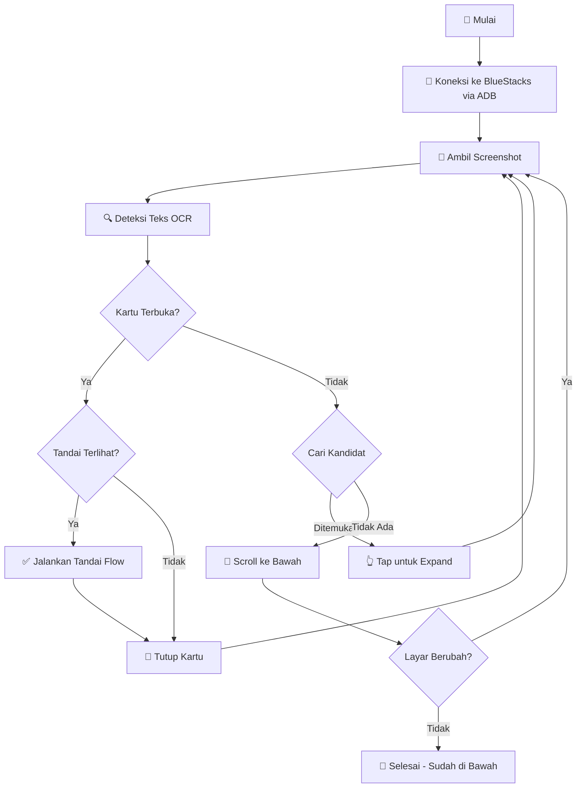

<div align="center">

# 🤖 BlueStacks Android Automation

**Sistem otomasi profiling & penandaan untuk aplikasi BPS MatchaPro**

[](https://python.org)
[](https://www.bluestacks.com/)
[](https://github.com/tesseract-ocr/tesseract)

---

*Otomasi tugas profiling repetitif pada aplikasi MatchaPro yang berjalan di emulator BlueStacks*

</div>

## ✨ Fitur

| Fitur | Deskripsi |
|-------|-----------|
| 🔍 **Deteksi OCR** | Menggunakan Tesseract OCR untuk mendeteksi teks dan elemen UI di layar |
| 🎯 **Deteksi Kartu Cerdas** | Otomatis menemukan kartu "Aktif" yang perlu diproses |
| ✅ **Auto-Tandai Flow** | Menyelesaikan seluruh alur kerja "Tandai" secara otomatis |
| 📜 **Manajemen Scroll** | Scroll presisi 178px dengan deteksi stuck/bottom |
| 🔄 **Auto-Recovery** | Menangani kartu terbuka, memuat data lebih banyak, dan pulih dari error |
| ⏹️ **Pencegahan Duplikat** | Melewati item yang sudah diproses (SUDAH, GC, STATUS, SELESAI) |

## 📋 Prasyarat

Sebelum menjalankan otomasi ini, pastikan sudah terinstall:

- **Python 3.8+** 
- **BlueStacks 5** emulator berjalan
- **Tesseract OCR** terinstall di `C:\Program Files\Tesseract-OCR\`
- **Aplikasi MatchaPro** sudah login

## 📱 Persiapan MatchaPro (PENTING!)

Sebelum menjalankan script, **WAJIB** setup layar MatchaPro seperti berikut:

### 1. Pilih Menu Ground Check
Buka sidebar menu → Pilih **[Ground Check] Direktori Usaha**

### 2. Set Filter
Atur filter dengan pengaturan berikut:

| Filter | Nilai |
|--------|-------|
| **Status Usaha** | ✓ Aktif |
| **Status GC** | Belum GC |
| **Lat/Long** | Ada Koordinat |

### 3. Posisikan Layar
- Scroll ke **usaha pertama** yang ingin ditandai
- Pastikan usaha tersebut **tepat di bawah nama username** (lihat gambar)
- Jangan ada kartu yang sudah terbuka (expanded)

> ⚠️ **PENTING**: Script akan mulai dari posisi layar saat ini. Jika posisi salah, script mungkin melewatkan item atau error.

## 🚀 Cara Menjalankan

### 1️⃣ Setup Pertama Kali (Sekali Saja)

```powershell
# Masuk ke folder project
cd "c:\Users\Axioo Pongo\Documents\Antigravity\KERJA\Bluestack"

# Buat virtual environment
python -m venv venv

# Aktifkan virtual environment
.\venv\Scripts\activate

# Install dependencies
pip install -r requirements.txt
```

### 2️⃣ Menjalankan Script (Setiap Kali)

```powershell
# Masuk folder, aktifkan venv, jalankan
cd "c:\Users\Axioo Pongo\Documents\Antigravity\KERJA\Bluestack"
.\venv\Scripts\activate
python bluestacks_automation.py
```

**One-liner (PowerShell) - Kalau venv sudah ada:**
```powershell
cd "c:\Users\Axioo Pongo\Documents\Antigravity\KERJA\Bluestack"; .\venv\Scripts\activate; python bluestacks_automation.py
```

**One-liner dengan Auto-Setup (kalau belum ada venv):**
```powershell
cd "c:\Users\Axioo Pongo\Documents\Antigravity\KERJA\Bluestack"; if (!(Test-Path "venv")) { python -m venv venv }; .\venv\Scripts\activate; pip install -r requirements.txt; python bluestacks_automation.py
```

### 3️⃣ Konfigurasi BlueStacks

Pastikan BlueStacks berjalan dengan ADB aktif:
- Buka BlueStacks Settings → Advanced
- Aktifkan **Android Debug Bridge (ADB)**
- Port default: `5555`

### 4️⃣ Menjalankan Script

```powershell
python bluestacks_automation.py
```

## ⚙️ Konfigurasi

| Parameter | Default | Deskripsi |
|-----------|---------|-----------|
| `adb_port` | `5555` | Port koneksi ADB untuk BlueStacks |
| `max_items` | `100` | Jumlah maksimum item yang diproses |

### Mengubah Parameter

```python
# Di bluestacks_automation.py
if __name__ == "__main__":
    BlueStacksAutomation(adb_port=5555).run(max_items=200)
```

## 📁 Struktur Project

```
Bluestack/
├── 📄 bluestacks_automation.py   # Script otomasi utama
├── 📄 requirements.txt           # Dependencies Python
├── 📄 README.md                  # File ini
└── 📄 temp_screenshot.png        # Screenshot sementara (auto-generated)
```

## 🔧 Cara Kerja



## 📊 Alur Otomasi

1. **Screenshot** → Ambil gambar layar saat ini
2. **Analisis OCR** → Ekstrak semua teks yang terlihat
3. **Deteksi Kartu** → Cek apakah ada kartu yang sudah terbuka
4. **Cek Tandai** → Jika kartu terbuka punya "Tandai", proses dulu
5. **Cari Kandidat** → Temukan badge "Aktif" yang belum diproses
6. **Expand & Proses** → Klik kartu, jalankan Tandai flow
7. **Scroll** → Pindah ke batch item berikutnya
8. **Ulangi** → Sampai mencapai bawah atau max items tercapai

## 🛠️ Dependencies

| Package | Versi | Fungsi |
|---------|-------|--------|
| `Pillow` | ≥10.0.0 | Pemrosesan gambar |
| `pytesseract` | ≥0.3.10 | Pengenalan teks OCR |

## ⚠️ Troubleshooting

<details>
<summary><b>🔴 Koneksi ADB Gagal</b></summary>

1. Pastikan BlueStacks berjalan
2. Cek ADB sudah diaktifkan di pengaturan BlueStacks
3. Coba restart BlueStacks
4. Pastikan port 5555 tidak diblokir

</details>

<details>
<summary><b>🔴 Tesseract Tidak Ditemukan</b></summary>

1. Install Tesseract OCR dari [GitHub](https://github.com/UB-Mannheim/tesseract/wiki)
2. Pastikan terinstall di `C:\Program Files\Tesseract-OCR\`
3. Atau ubah path di `bluestacks_automation.py`

</details>

<details>
<summary><b>🔴 Kartu Tidak Terdeteksi</b></summary>

1. Pastikan sudah di layar yang benar di MatchaPro
2. Level zoom harus default
3. Resolusi layar harus sesuai dengan koordinat yang diharapkan

</details>

## 📝 Riwayat Versi

| Versi | Tanggal | Perubahan |
|-------|---------|-----------|
| 0.73 | 2026-01 | Deteksi Tandai cerdas pada kartu terbuka, README profesional |
| 0.72 | 2026-01 | Logika bottom lebih baik, scroll 178px |
| 0.71 | 2026-01 | Tambah deteksi stuck, swipe lebih kuat |
| 0.70 | 2026-01 | Penulisan ulang lengkap dengan deteksi OCR |
| 0.60 | 2025-12 | Rilis awal dengan otomasi berbasis koordinat |

---

<div align="center">

**Dibuat dengan ❤️ untuk Profiling Statistik BPS oleh Albert Assidiq**

*Otomasi hal-hal membosankan, fokus pada yang penting*

</div>
